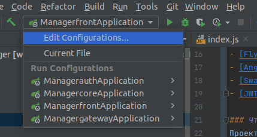
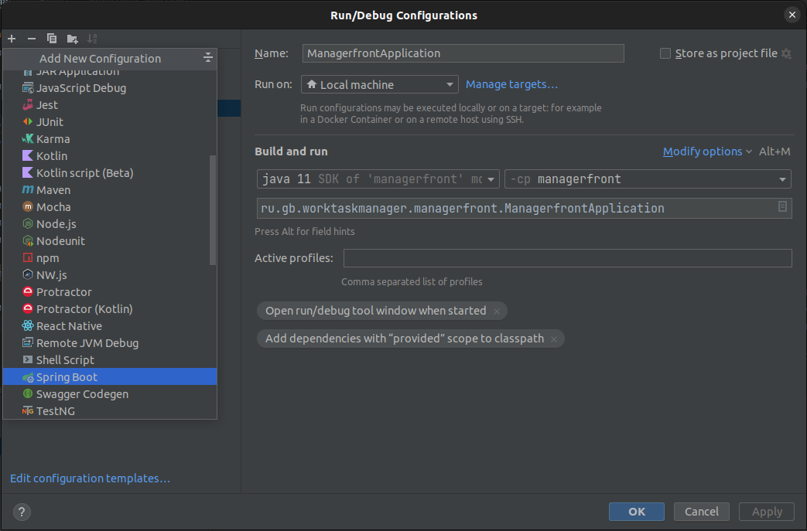
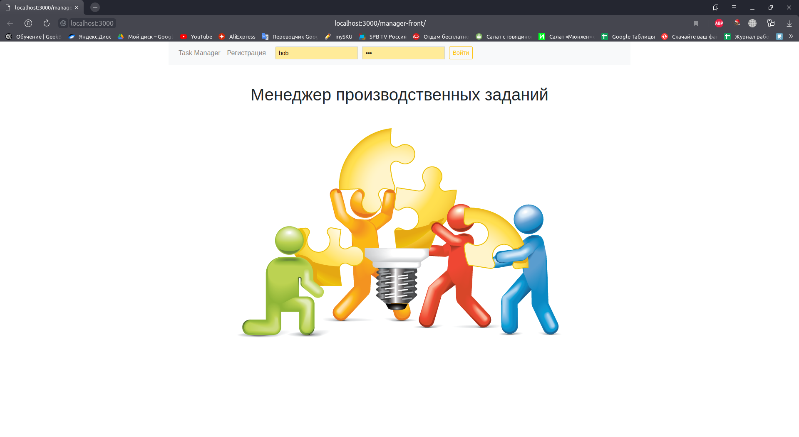
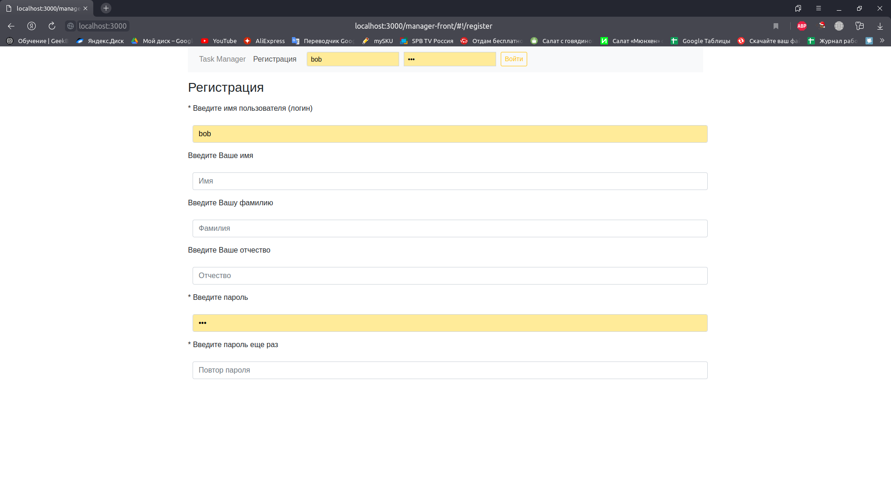
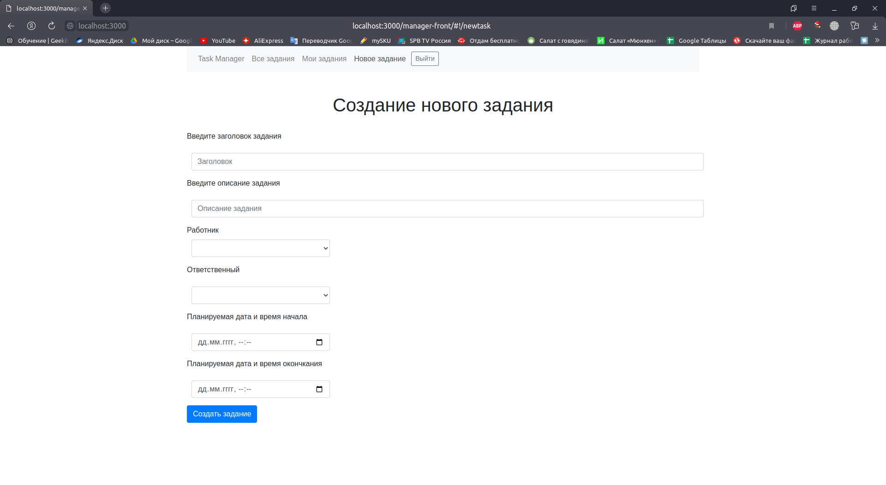
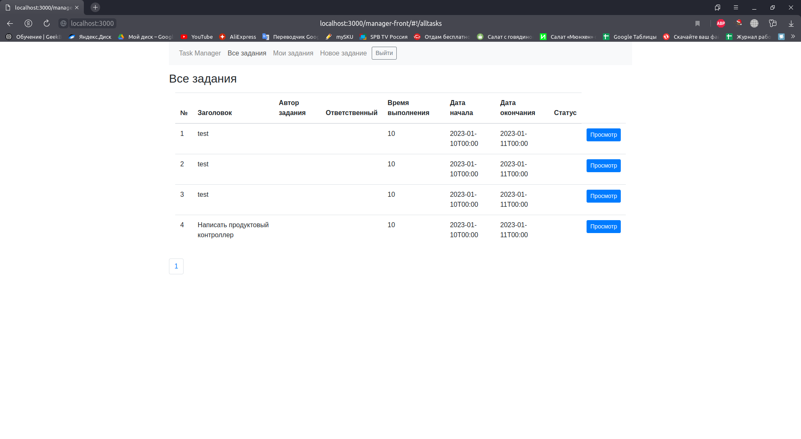
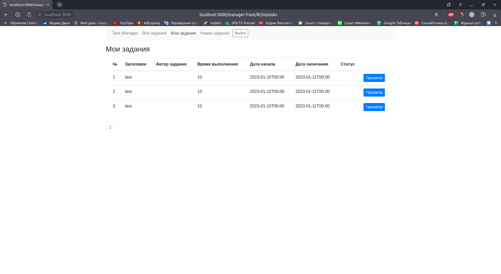
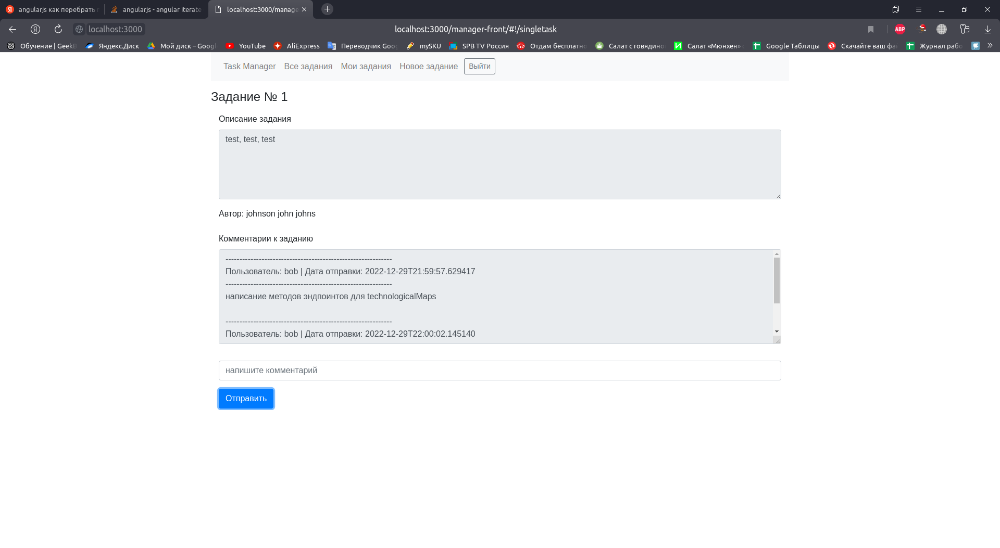

# Worktask Manager
> #### Web-сервис для управления рабочим временем сотрудников
### Назначение сервиса:
- выдавать производственные задания
- устанавливая сроки выполнения задания
- получать отчеты по заданиям
- рассчитывать эффективность работников
- Эффективно организовывать работу отдела/цеха

### Технологии
- [Spring boot](https://spring.io/projects/spring-boot)
- [H2](https://www.baeldung.com/spring-boot-h2-database)
- [Flyway](https://www.baeldung.com/database-migrations-with-flyway)
- [Angular JS](https://angularjs.org/)
- [Swagger](https://habr.com/ru/post/541592/)
- [JWT](https://jwt.io/)

### Что содержит проект
Проект является Spring boot приложением, содержит в себе следующие сервисы:
- managergateway -предоставляет шлюз API, построенный на основе экосистемы Spring.Часть системы безопасности для доступа к API других сервисов.
- managerauth - сервис авторизации и регистрации пользователей.
- managercore - основной сервис работы с заданиями.
- managerfront - фронтэнд системы.

### Запуск
Проект создан в IDE [IntelliJ IDEA](https://www.jetbrains.com/idea/)

Для корректного запуска необходимо установить следующий софт:

- [IntelliJ IDEA](https://www.jetbrains.com/idea/)
- [JDK 11](https://www.oracle.com/java/technologies/javase/jdk11-archive-downloads.html)

Для запуска приложений необходимо склонировать [проект](https://github.com/Fairness2/work_task_manager)
Далее дождаться пока Maven подтянет все зависимости и запустить каждый сервис.
Если конфигураций для запуска [IntelliJ IDEA](https://www.jetbrains.com/idea/) не создала автоматически, то необходимо это выполнить вручную. Для этого:
- в окне выбора конфигурации для запуска нажать "Edit Configurations..."

- и для каждого сервиса создать свою конфигурацию запуска нажав Alt+Ins и выбрав SpringBoot

По умолчанию доступ к FrontEnd части проекта осуществляется введя адрес http://localhost:3000/manager-front в адресной строке вашего браузера
Для тестового использования добавлено два пользователя
- bob пароль: 100
- john пароль: 100

### Frontend

- Главная страница

- Если вы не зарегистрированы, есть возможность зарегистрироваться и далее авторизоваться

- Далее есть возможность создать новое задание для своего подчиненного

- Просмотреть все задания для всех пользователей системы

- Просмотреть только задания выданные вам

- Открыть карточку задания

### Backend

- Регистрация
- Авторизация
- Получение списка пользователей (всех/по id пользователя)
- Добавление заданий
- Получение заданий (всех/по id пользователя/по id задания)
- Изменение статусов заданий
- Заявки на приостановление/возобновление заданий
- Добавление комментариев